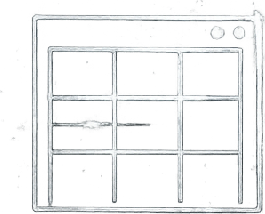
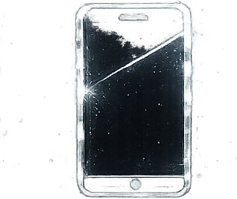

  

  

**Software lab — products engineered end to end.**

Storefronts with real payment rails. Apps that live inside Telegram. Products where
the wallet is the account. Play economies with a ledger underneath. Assistants that
answer for a business. One lab builds all of it — and holds it to one standard.

Built to the same standard, whatever the surface.

 

<table>
<tr>
<td align="center" width="90"> <b>WEB</b></td>
<td><b>Web Platforms</b> Storefronts and product surfaces engineered from an empty repository to a paying customer — catalogue and checkout, payments that reconcile server-side, an operator console, and the gates that keep it safe to leave alone. PROOF — A LIVE STORE, TEN WEEKS · NEXT.JS · NODE · PAYMENTS</td>
</tr>
<tr>
<td align="center" width="90"> <b>MOBILE</b></td>
<td><b>Mobile &amp; Mini Apps</b> Products that live inside the app your audience already has open: verified sessions, deep-link campaign routing, wallet-native checkout, and theming that follows the client instead of fighting it. PROOF — A YEAR IN THE LEAD SEAT · TWA · REACT · DEEP LINKS</td>
</tr>
<tr>
<td align="center" width="90"> <b>BLOCKCHAIN</b></td>
<td><b>Blockchain Systems</b> On-chain products where the wallet is the account: signature auth, transactions the server composes and the client never assembles, ownership and subscription models across TON, Bitcoin and EVM. PROOF — THREE CHAINS SHIPPED · TON · PSBT · EVM</td>
</tr>
<tr>
<td align="center" width="90"> <b>GAMES</b></td>
<td><b>Game Layers</b> The loop that keeps an app open: 3D play rendered in-page, timed reward windows, referral tiers with an explicit claim — and the ledger underneath, because a reward economy is an accounting system before it is a game. PROOF — A PLAY ECONOMY IN PRODUCTION · R3F · WEBGL</td>
</tr>
<tr>
<td align="center" width="90"> <b>AI</b></td>
<td><b>AI Systems</b> Assistants that answer for a business rather than a demo: intent routing, hardened prompts, bot checks that fail closed, and delivery into the channel where people actually reply — all running at the edge. PROOF — A CONCIERGE FILLING A CALENDAR · WORKERS AI · EDGE</td>
</tr>
</table>

<table>
<tr><td><b>Copa Sport Store</b> E-COMMERCE · LIVE</td><td>The store for Brazilian football kits — engineered end to end.</td></tr>
<tr><td><b>Care Touch Cleaning</b> SERVICES · LIVE</td><td>A working cleaning company — and the digital operation that fills its calendar.</td></tr>
<tr><td><b>Toygers</b> WEB3 · ARCHIVED</td><td>Physical, limited-edition art assets with provable on-chain ownership.</td></tr>
<tr><td><b>Horizon</b> WEB3 · ARCHIVED</td><td>Buildings owned in fractions — a stake in real property, as simple as a share.</td></tr>
<tr><td><b>Runes Land</b> WEB3 · ARCHIVED</td><td>The launchpad and trading floor of the 2024 Runes wave.</td></tr>
<tr><td><b>Agora AI</b> AI · ARCHIVED</td><td>An AI marketplace inside Telegram, unlocked by on-chain subscriptions.</td></tr>
<tr><td><b>SatView</b> WEB3 · ARCHIVED</td><td>TradingView-grade charts for tokens living inside Bitcoin.</td></tr>
<tr><td><b>Audaces</b> 3D SOFTWARE · DELIVERED</td><td>Garments modelled in 3D, unfolded into the patterns that sew them.</td></tr>
</table>

- **Money paths are server-authoritative.** Prices, charges and entitlements are computed where the client can't touch them.
- **Strict TypeScript, end to end.** No `any`, no silent edges — the compiler is part of the review.
- **Every surface ships through gates.** Design review, responsive audit, accessibility, motion discipline — before merge, not after complaints.
- **Honest states over decoration.** Reduced motion gets a complete page; empty data gets a truthful label; nothing pretends.
- **One lab, end to end.** Product, engineering and the operations that keep it running — no hand-offs between vendors.

  

TIMEZONE &nbsp; **UTC−3 · São Paulo** &nbsp;&nbsp;&nbsp; SITE &amp; CHANNELS &nbsp; **being connected**

 

**Start with one message.**

The work above is the introduction — the site and direct channels arrive with the launch.

  

© 2026 blaclab

